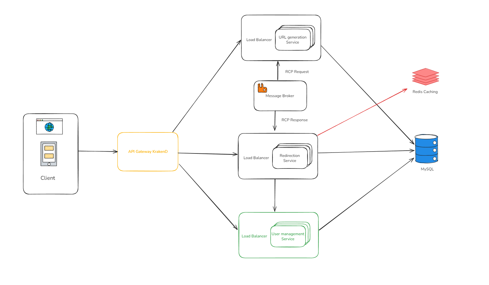

# URL Shortener – Backend API

A complete microservices-based URL shortening platform built with **NestJS**, **TypeScript**, **MySQL**, **Redis**, **RabbitMQ**, and **KrakenD** as the API Gateway.

---

## 🧩 Project Overview

This project is designed to demonstrate backend architecture using modern technologies and good practices. It allows users to register, log in, shorten URLs, manage their links, and track how many times each shortened URL was accessed.

The codebase is modular, organized in a **monorepo** using `pnpm` workspaces, and follows a **microservices architecture**.

---

## 🧱 Architecture

- **User Management Service** – Handles user registration, authentication, and JWT token management.
- **URL Service** – Stores, edits, deletes, and tracks clicks for shortened URLs.
- **Redirection Service** – Redirects users to the original URL and emits events to update click counts.
- **KrakenD API Gateway** – Routes external HTTP requests to the appropriate microservice.
- **RabbitMQ** – Facilitates async communication between services.
- **Redis** – Used for caching (more configuration for future scalability).

> **Note:** For simplicity, all services currently use the same MySQL database. In a real-world system, each service would use its own isolated database for better separation of concerns, scalability, and fault tolerance.

---

## 🧪 Local Setup

You can run this project using **Docker** (recommended) or locally via **pnpm**.

### ✅ Option 1: Docker (Recommended)

1. Ensure Docker is installed and running.
2. Create `.env` files in:
   - `url-service`
   - `user-management-service`
   - `redirection-service`
   
   Use the `.env.example` files as a base. Default values are already configured to run locally.
3. From the project root, run: `docker-compose up`

All services, including KrakenD and MySQL, will start and connect properly.

---

### 🛠️ Option 2: Local Development

> ⚠️ You must have a local MySQL and RabbitMQ instance running. Services will not start correctly without valid `.env` configuration.

1. Install Node.js (version 18+)
2. Install `pnpm` globally: `npm install -g pnpm`
3. Install dependencies: `pnpm install`
4. Start all services: `pnpm run dev`

### 🧪 Tests

Run tests in root folder with `pnpm run test`

---

Services will be available at:

- Redirection Service: http://localhost:3000
- URL Service: http://localhost:3001
- User Management Service: http://localhost:3002

> Note: The KrakenD API Gateway is not started via `pnpm` and must be run with Docker.

---

## 📦 Tech Stack

- **NestJS** – Server framework
- **TypeScript** – Primary language
- **MySQL** – Relational database
- **Redis** – Caching and key-value store
- **RabbitMQ** – Message broker
- **KrakenD** – API Gateway
- **Docker** – Container management
- **pnpm** – Package and monorepo manager
- **Turborepo** – For orchestration of multiple projects

---

## 📁 Insomnia Workspace

To simplify API testing, an [Insomnia](https://insomnia.rest) export file is included:  
**`url-shortener-insomnia-pack.json`**

### To use:

1. Open Insomnia.
2. Click `Import Data` → `From File`.
3. Select the JSON file and start testing the endpoints.

---

## ⚠️ Simplifications and Dev-Only Configurations

- All microservices share a single database instance. This is **only for demo and testing purposes**. In production, **each service should have its own isolated database**.

- No load balancer (e.g., NGINX or Kubernetes Ingress) is used in this local setup. This was omitted to keep local development simple, but in a real-world environment, a **load balancer would be required** for horizontal scaling and failover.

- **Automatic database synchronization (`synchronize: true`)** is enabled in the TypeORM config.  This is strictly for **local testing only**. In production, **migrations should always be used** (and they already created in `src/db/migrations` folder) and schema syncing must be disabled.

---

## 🔮 Future Improvements & Scalability Challenges

If this system needs to scale horizontally, here are some recommendations and anticipated challenges:

### ✅ Improvements to Prepare for Horizontal Scaling:

- **Separate databases per service** to enforce clear data ownership and facilitate replication/sharding.
- **Use Kubernetes** to orchestrate containers and implement automatic scaling, health checks, and zero-downtime deployments.
- **Rate limiting** at the gateway level to prevent abuse.
- **Scale the Redirection Service horizontally**, as it is expected to handle the highest volume of traffic. It should have the highest number of replicas and benefit from **aggressive caching strategies** (e.g., Redis).
- **Introduce a read replica for the URL Service database**, allowing the Redirection Service to perform read operations without impacting the primary database. This reduces load and improves latency. Additionally, ensure that the database maintains indexes on the `short_url` field at all times to guarantee fast lookups under high traffic.

### ⚠️ Scalability Challenges:

- **Message queue bottlenecks:** RabbitMQ must be monitored and potentially scaled for high click traffic.
- **Eventual consistency:** With more services, syncing data asynchronously can lead to consistency issues.
- **Database contention:** Without sharding, read replicas or proper indexes, the MySQL database could become a bottleneck.
- **Service-to-service latency:** Adding more services introduces more hops and potential failures, requiring retries and timeouts.

---

## 📜 License

This project is licensed under the MIT License.

---

## 👨‍💻 Author

**Lucas Bomfim Mujo de Mattos**  
Full Stack Developer  
[LinkedIn](https://www.linkedin.com/in/lucasbommattos)  

